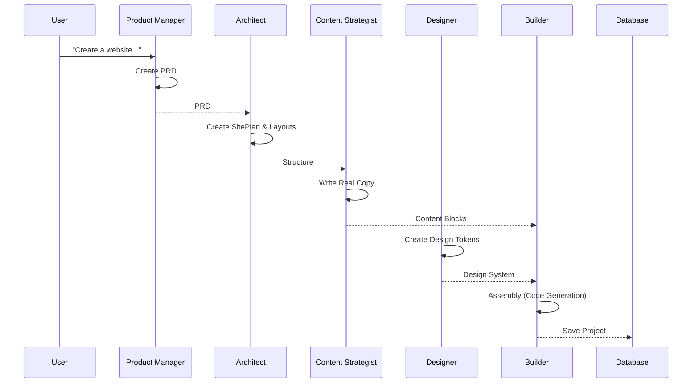
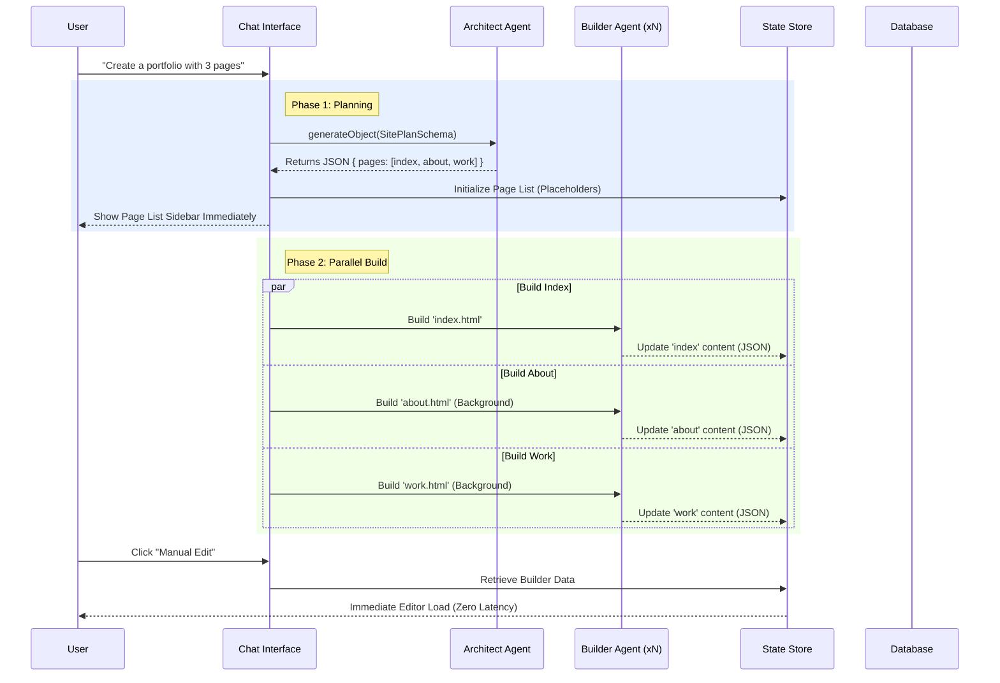

# System Architecture & Design Decisions

This document consolidates the key architectural decisions and system designs for the project, specifically regarding the "Agent Orchestra" workflow, data lifecycle, memory management, and asset storage.

## 1. Multi-Agent Workflow: "Agent Orchestra" (Phase 2)

To ensure high-quality page generation with accurate structure and meaningful content, we utilize a 5-step multi-agent workflow that separates "Thinking" (Strategy/Content) from "Doing" (Coding).

### The 5-Step Flow

1.  **Product Manager (PM)** `[The Brain]`
    *   **Input**: User's raw prompt (e.g., "A crypto DAO landing page").
    *   **Output**: **PRD (Product Requirements Doc)**. Contains core value proposition, target audience, and key feature requirements.
    *   **Role**: Anchors the project in specific requirements to prevent generic outputs.

2.  **Architect** `[The Skeleton]`
    *   **Input**: PRD.
    *   **Output**: **SitePlan** (Site Map) + **LayoutStrategy**.
    *   **Role**: Defines the technical structure (pages/sections) and specific layout strategies (e.g., "Asymmetric Grid" for features) without writing content.

3.  **Content Strategist** `[The Voice]`
    *   **Input**: PRD + SitePlan.
    *   **Output**: **ContentBlocks** (Real Copy).
    *   **Role**: Generates actual, context-aware text (Headlines, Body, CTAs) *before* the UI is built. This prevents "Lorem Ipsum" and ensures the UI fits the content length.

4.  **Designer** `[The Skin]`
    *   **Input**: PRD.
    *   **Output**: **DesignSystem** (Tailwind Config: Colors, Fonts, BorderRadius).
    *   **Role**: Ensures visual consistency across all components.

5.  **Builder** `[The Hands]`
    *   **Input**: DesignSystem + ContentBlocks + LayoutStrategy.
    *   **Output**: **React/HTML Code**.
    *   **Role**: Pure execution. Assembles the provided content and styles into code using the defined layout strategies. No hallucination of content allowed.

---

## 2. Project Data Lifecycle

The system relies on a **Database + Virtual File** model. No physical `.html` or `.tsx` files are created on the server for user projects.

### Lifecycle Stages

1.  **Creation (The Record)**
    *   **Action**: User starts a new project.
    *   **State**: A record is inserted into Supabase `projects` table immediately. `content` field is an empty JSON `{ "pages": [] }`. Project ID is generated.

2.  **Generation (The Stream)**
    *   **Action**: AI runs the workflow.
    *   **State**: Code and structure exist **only in Browser Memory (Zustand Store)**.
    *   **Risk**: If the browser is closed before saving, this data is lost (unless auto-save triggers).

3.  **Persistence (The Save)**
    *   **Action**: Auto-save or Manual Save.
    *   **State**: The in-memory HTML strings and Builder JSON are serialized and sent to the API.
    *   **Storage**: DB updates `content` (HTML for rendering) and `content_json` (JSON for the Builder).

4.  **Runtime (The View)**
    *   **Action**: User visits `subdomain.dao123.me`.
    *   **State**: Middleware fetches the HTML string from DB -> Next.js SSR renders it.
    *   **Cache**: Next.js Data Cache stores the DB response. `revalidatePath` clears this cache on save.

---

## 3. Memory Architecture

The system does **NOT** use external caching services like Redis or Memcached. "Memory" refers to:

1.  **Client-Side Memory (RAM)**
    *   **Technology**: React State / Zustand Store.
    *   **Role**: Holds the "working copy" of the project, including the Builder state, chat history, and undo/redo stack.

2.  **Server-Side Cache (Data Cache)**
    *   **Technology**: Next.js Internal Cache (FileSystem/Memory).
    *   **Role**: Caches DB queries (`getProject`, `getDomainConfig`) to speed up page loads for visitors.

---

## 4. Asset Storage Strategy

We use a hybrid approach for storing different types of images:

| Image Type | Storage Location | Mechanism |
| :--- | :--- | :--- |
| **User Uploads** | **Supabase Storage** | Files uploaded to `assets` bucket -> Public URL stored in DB `assets` table. |
| **Project Previews** | **Database (Base64)** | `html2canvas` captures screenshot -> Base64 string -> Stored in `projects.preview_image` column. |
| **AI Generated** | **External URLs** | AI generates `` tags pointing to external sources (Unsplash, etc.). **Not** hosted locally. |

### Rationale
*   **Uploads**: Need persistence and CDN delivery.
*   **Previews**: Small thumbnails, easiest to keep consistent with project record in one DB transaction.
*   **AI Images**: Reduce storage costs by linking to external providers.

---

## 5. Manual Editing Workflow (The Bridge)

The system supports a seamless transition from "AI Chat Mode" (HTML-based) to "Visual Builder Mode" (JSON-based).

### The Conversion Process ("Refine Structure")
When a user clicks "Manual Edit", the system must cross the bridge from raw string HTML to structured component JSON.

1.  **Heuristic Check**: First, we check if valid Builder Data (`content_json`) already exists.
2.  **AI Transformation (The Bridge)**: If no JSON exists (e.g., fresh AI generation), we call `convertHtmlToBuilder` (via `ai-transform.ts`):
    *   **Input**: Raw HTML String.
    *   **Processor**: LLM (Claude 3.5 Sonnet).
    *   **Strategy**: "Hybrid Approach".
        *   *High-Level*: Maps standard sections (Hero, Navbar) to pre-built components (`BuilderHero`).
        *   *Atomic*: Maps custom layouts to `BuilderContainer`, `BuilderRow`, `BuilderText` with Tailwind classes.
    *   **Output**: Craft.js compatible JSON tree.
3.  **Interactive Editing**:
    *   User enters the Visual Editor (Drag & Drop).
    *   Changes update the JSON state (`builderData`).
    *   **One-Way Sync**: Currently, Builder changes **overwrite** the HTML view when saved, but editing HTML text in Chat does **not** automatically update the Builder JSON (requires re-conversion).

---

## 6. Remix & Share Logic

The community ecosystem relies on a "Forking" model.

### Workflow
1.  **Publish**: User A publishes project -> `is_public=true`.
2.  **Clone (Fork)**: User B clicks "Remix".
    *   System creates a **NEW** Project ID for User B.
    *   Deep clones `content` (HTML) and `content_json` (JSON).
    *   **No Reference**: The new project is independent. Changes by B do not affect A.
3.  **Republish**: User B publishes to a **new subdomain**.

---

## 7. Core Algorithms & Intelligence

The system makes use of specialized algorithms for different stages of content processing.

### A. Content Acquisition (Mozilla Readability)
*   **Location**: `src/lib/web-page-recognition.ts`
*   **Purpose**: Extracts clean, readable content (Main Text, Title, Byline) from arbitrary URLs, removing ads and sidebars.
*   **Use Case**: Used when a user imports an external link to generate a site based on an existing article or blog post.
*   **Library**: `@mozilla/readability` + `jsdom`.

### B. Heuristic Importer (The Intelligent Parser)
*   **Location**: `src/lib/builder/htmlInfoCraft.ts`
*   **Purpose**: Intelligent "Reverse Engineering" of raw HTML into editable Builder Components.
*   **Logic**: Uses `DOMParser` to traverse the tree and applies heuristic rules (e.g., "Has `nav` tag?" -> `BuilderNavbar`, "Has `h1` + `button`?" -> `BuilderHero`) to identify components.
*   **Key Feature**: Parses Tailwind classes to extract style props.
*   **Use Case**: Client-side "Auto-Convert" when switching from Chat Mode to Builder Mode.

### C. AI Transformer (Structure Generator)
*   **Location**: `src/lib/ai/transformer.ts`
*   **Purpose**: Flattens the hierarchical AI response (`ComponentNode` tree) into the flat, ID-referenced JSON format required by Craft.js.
*   **Use Case**: Final step of the AI generation pipeline before sending data to the frontend.

---

## 8. Zero-Loss Architecture (The Transformation Fix)
## 8. Zero-Loss Architecture (System 2.0)

To solve the "missing pages" issue and ensure high-fidelity editing, the system employs a **Multi-Agent Parallel Architecture**.

#### 8.1 Core Philosophy: "Map then Build"
Instead of generating a monolithic HTML string (which is prone to token limits and truncation), the system splits the process into two distinct phases:

1.  **Structure Phase (Architect Agent)**: Defines the *existence* and *purpose* of every page.
2.  **Construction Phase (Builder Agent)**: Builds the *content* of each page in parallel.

#### 8.2 Agent Roles

#### 8.2 Agent Roles (The "Iron Triad")

*   **Architect Agent (The Planner)**
    *   **Integrates**: Product Manager (PM) & Strategy.
    *   **Goal**: Translate abstract user intent into a concrete Site Map.
    *   **Output**: `SitePlanSchema` (JSON).
    *   **Behavior**: Extremely fast (<3s). Determines page paths (`index.html`, `about.html`), section flow, and `contentRequirements`.
    *   **Impact**: Ensures no pages are "forgotten" and high-level requirements are captured.

*   **Designer Agent (The Stylist)**
    *   **Goal**: Define the visual language.
    *   **Output**: `DesignSystem` (JSON).
    *   **Behavior**: Generates a unified theme (colors, typography, spacing) that applies to *all* pages.
    *   **Impact**: Ensures visual consistency across the entire site.

*   **Builder Agent (The Worker)**
    *   **Integrates**: Content Planner & Copywriter.
    *   **Goal**: Generate component trees for individual pages.
    *   **Output**: `ComponentSchema` (JSON) -> Converted to Craft.js Nodes.
    *   **Behavior**: Runs in parallel. Inherits the `DesignSystem` and fills in the `SitePlan` with concrete content and structures.
    *   **Impact**: 100% fidelity. What the AI designs is exactly what appears in the Visual Editor.

#### 8.3 Data Flow Diagram

#### 8.4 The "Bridge" (Legacy Support)
For content imported from external URLs or pasted code, we retain the **Backend Fidelity Parser** (Strategy B) to convert raw HTML into Builder JSON without loss. This ensures the system remains compatible with non-AI sources.
